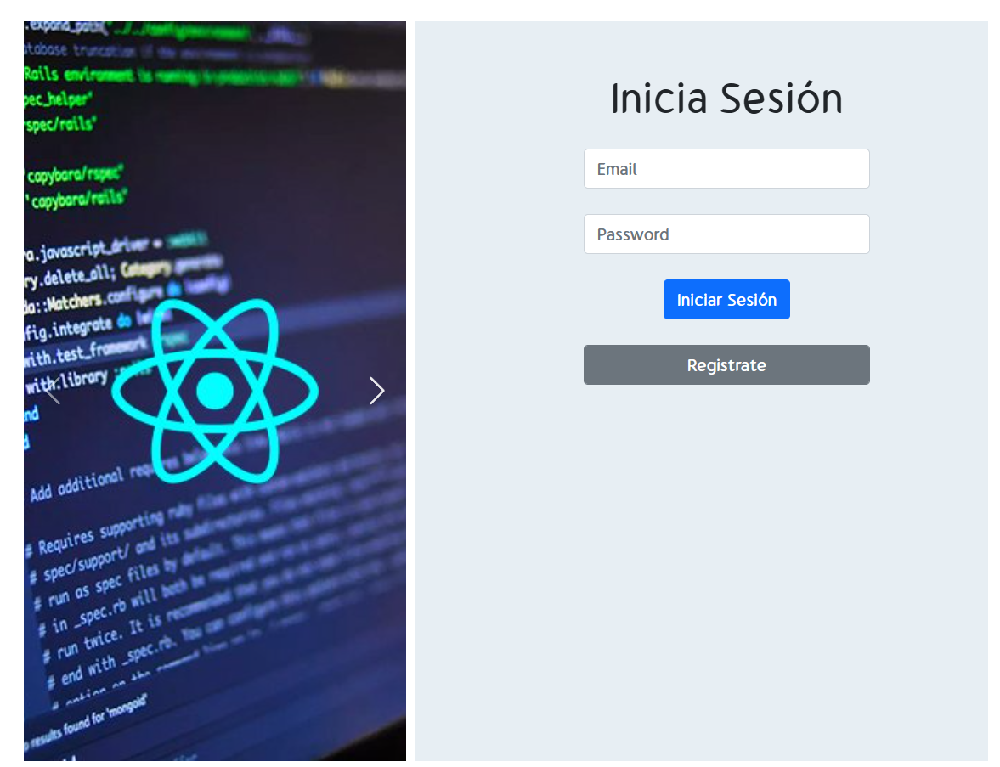

# Firebase V9 con React

Crud con **Autenticación** por email y almacenamiento de usuarios en db de **Firestore**

<!-- [tutorial](https://www.youtube.com/watch?v=GmVRhPVH_2A&t=548s) -->

## Recuerda

- Instala lo módulos

      npm install

- Correr en local

      npm run start

## Usuario de prueba

    email: pedrito@hotmail.com
    pass:  123456

***También puedes crear tu propio usuario***

## Vista previa

