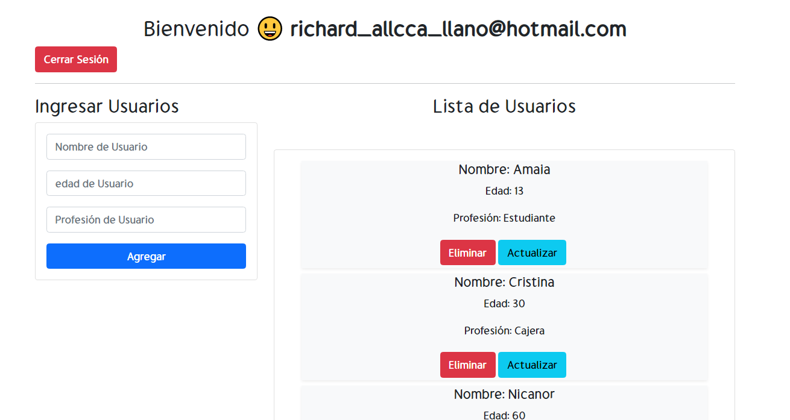

# Firebase V9 con React

## Hi 🖐️ I am Thouma

---

## Descripción del Proyecto

---

- Aplicación para el uso de Firebase con Authentication.
- CRUD para el uso de peticiones a Firestore.
- También utilice useContext para el manejo de estados y control de formulario

[ver Demo Online]()
  

---

---

## Dependencias

    npm i firebase
    npm i firestore

---

## Activar Servicios

1. Activar la Autenticación
   - crear un archivo "credenciales.js" para datos generados  
2. Crear base de datos con Firestore
   - En modo desarrollo debes actualizar las reglas de seguridad en 30 dias

---

## Enlaces

1. [configuración firebase](https://www.youtube.com/watch?v=rG0YjUvIFlg&list=PLMxuD8_QOm5V8vFIZELCbYgIuQF5C-FRL&index=2)

---

## Theme Vs code

- Nigth Wolf (dark blue) (No italics)
